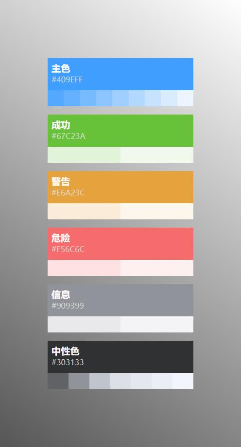
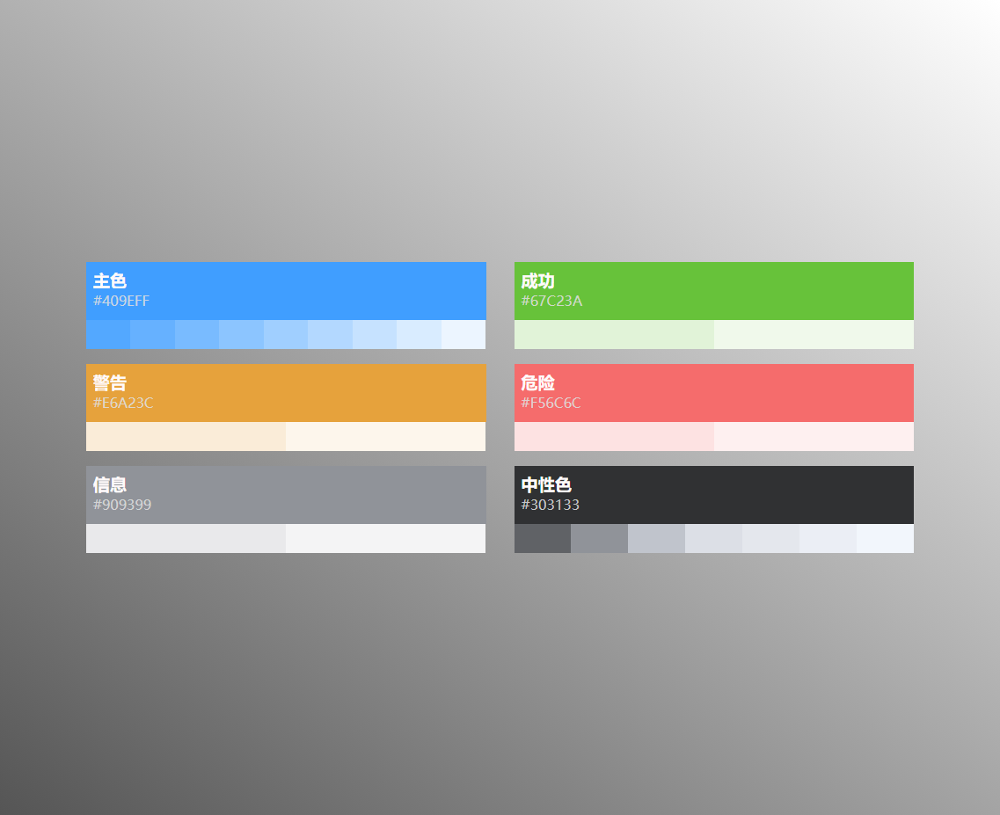

# 网站配色色卡
------
+ 网站配色色卡
+ 点击复制十六进制颜色值
+ flex布局
+ 数据保存在`json文件`中

* 数据结构
```json
[
    {
        "title":"主色",
        "main":"409eff",
        "body":["53a8ff","66b1ff","79bbff","8cc5ff","a0cfff","b3d8ff","c6e2ff","d9ecff","ecf5ff"]
    },
    {
        "title":"成功",
        "main":"67c23a",
        "body":["e1f3d8","f0f9eb"]
    },
    {
        "title":"警告",
        "main":"e6a23c",
        "body":["faecd8","fdf6ec"]
    },
    {
        "title":"危险",
        "main":"f56c6c",
        "body":["fde2e2","fef0f0"]
    },
    {
        "title":"信息",
        "main":"909399",
        "body":["e9e9eb","f4f4f5"]
    },
    {
        "title":"中性色",
        "main":"303133",
        "body":["606266","909399","c0c4cc","dcdfe6","e4e7ed","ebeef5","f2f6fc"]
    }
]

```

* 示例图片1


* 示例图片2

